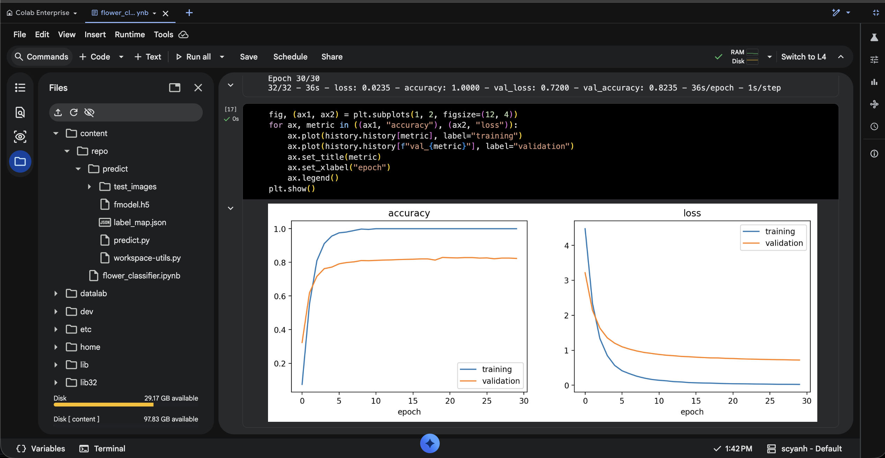
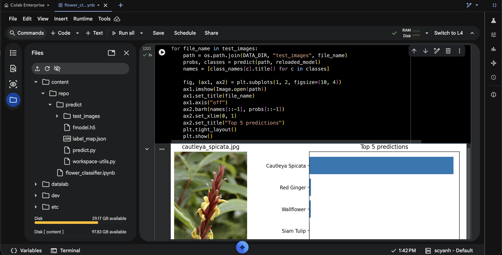

# Flower Image Classifier with TensorFlow

[](https://colab.research.google.com/github/scyanh/image_classifier_tensorflow/blob/main/flower_classifier.ipynb)


A deep learning model that recognizes **102 species of flowers** from a photo. It uses transfer learning on **MobileNetV2** (TensorFlow Hub) trained on the [Oxford Flowers 102](https://www.robots.ox.ac.uk/~vgg/data/flowers/102/) dataset, and ships with a command-line app that returns the top-K most likely species for any image.

The full workflow lives in a Jupyter notebook ([`flower_classifier.ipynb`](flower_classifier.ipynb)) that runs locally, in Google Colab, in Colab Enterprise or in Vertex AI Workbench.

## Results

| Metric | Value |
|---|---|
| Test accuracy (6,149 held-out images, 102 classes) | **78.7%** |
| Validation accuracy (final epoch) | 82.7% |
| Trainable parameters | 130,662 of 2.39M |
| Model size | 10.9 MB (Keras HDF5) |

Numbers come from the run saved in the notebook; retraining gives slightly different values (the Colab Enterprise run below ended at 82.4% validation accuracy).

### Training curves

Accuracy and loss for training and validation over 30 epochs, trained in Colab Enterprise:



The model was trained for **30 epochs**, each one a pass over the 1,020 training images in 32 batches of 32. Validation accuracy climbs fast during the first epochs and **starts to flatten after epoch 7** (~80%); the remaining 23 epochs add fewer than 3 points (82.7% at epoch 30). Training accuracy reaches 100% around epoch 12, and the gap between both curves comes from the small training split (10 images per class). Validation loss kept decreasing slowly until the end, so early stopping never triggered.

### Prediction on a new image

Top 5 predictions for a photo outside the dataset:



## How it works

1. **Data:** Oxford Flowers 102 loaded with TensorFlow Datasets. The `train` and `validation` splits have 1,020 images each (10 per class); `test` has 6,149.
2. **Input pipeline:** `tf.data` resizes every image to 224×224, scales pixels to [0, 1], caches the small splits and prefetches batches of 32.
3. **Model:** MobileNetV2 pre-trained on ImageNet, frozen, as a feature extractor (1,280-dimensional embedding), followed by dropout (0.2) and a 102-way softmax layer. Only the classification head is trained.
4. **Training:** Adam with sparse categorical cross-entropy, up to 30 epochs with early stopping on validation loss (patience 3, best weights restored).
5. **Evaluation:** accuracy on the test split, which is never used for training or model selection.
6. **Export and inference:** the model is saved as a Keras HDF5 file, reloaded and checked against the in-memory model, then served by `predict/predict.py`.

## Repository structure

```
flower_classifier.ipynb   Notebook: data, training, evaluation, export and inference
predict/
  predict.py              Command-line app (top-K predictions for one image)
  fmodel.h5               Trained model
  label_map.json          Class id → flower name
  test_images/            Four sample photos outside the dataset
```

## Run the notebook

**Google Colab or Colab Enterprise:** open the notebook with the badge above, or import `flower_classifier.ipynb` into Colab Enterprise (Vertex AI). The first cells install the dependencies and clone this repository to get `label_map.json` and the sample images. The default CPU runtime is enough; training takes a few minutes.

**Locally with Jupyter:** tested with Python 3.12 on macOS (Apple Silicon, CPU).

```bash
python3.12 -m venv .venv
source .venv/bin/activate
pip install tensorflow notebook matplotlib
jupyter notebook flower_classifier.ipynb
```

The setup cell installs the `tf-keras` version that matches TensorFlow, plus `tensorflow-hub` and `tensorflow-datasets`. The dataset (~340 MB) downloads on first run.

## Command-line app

```bash
pip install tensorflow tensorflow-hub tf-keras "pandas<3" pillow "setuptools<81"
cd predict
TF_USE_LEGACY_KERAS=1 python predict.py test_images/cautleya_spicata.jpg fmodel.h5 --top_k 5 --category_names label_map.json
```

```
             Flower  Probability
0  Cautleya Spicata    95.989998
1        Red Ginger     1.510000
2        Wallflower     0.830000
3        Snapdragon     0.270000
4        Siam Tulip     0.180000
```

`TF_USE_LEGACY_KERAS=1` is required on TensorFlow 2.16+ because the TensorFlow Hub layer uses the Keras 2 API (`tf-keras`).

## Background

Originally built in 2020 for Udacity's *Intro to Machine Learning with TensorFlow* Nanodegree. Updated in 2026 to run on current TensorFlow and Colab Enterprise, to report accuracy on the held-out test set and to reduce overfitting with dropout and early stopping.
